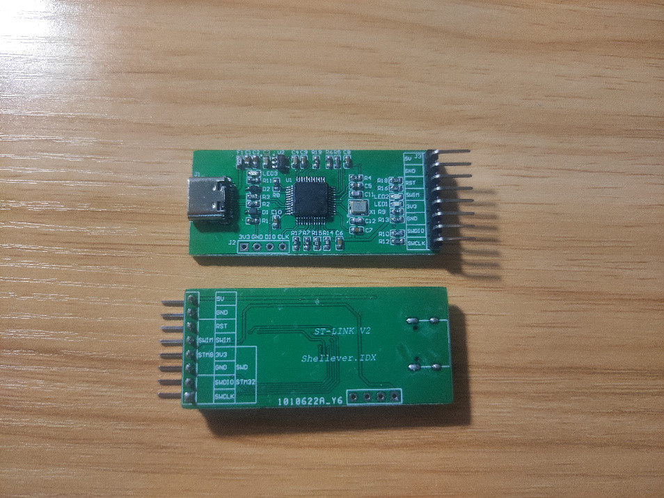
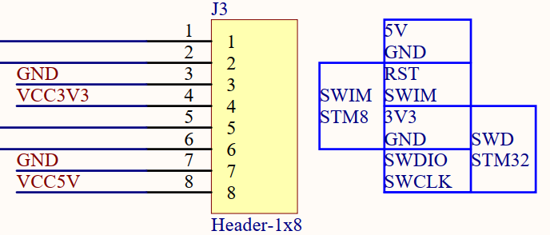
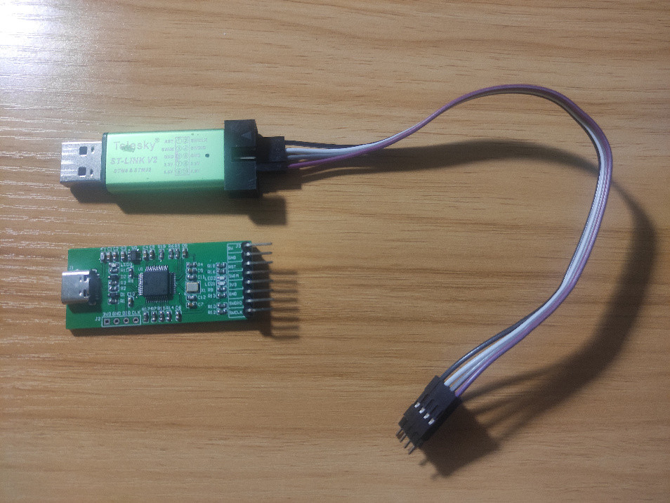
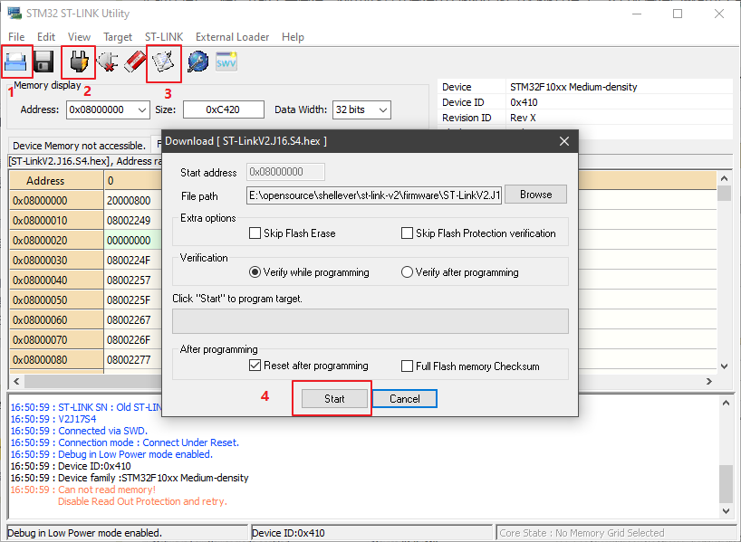
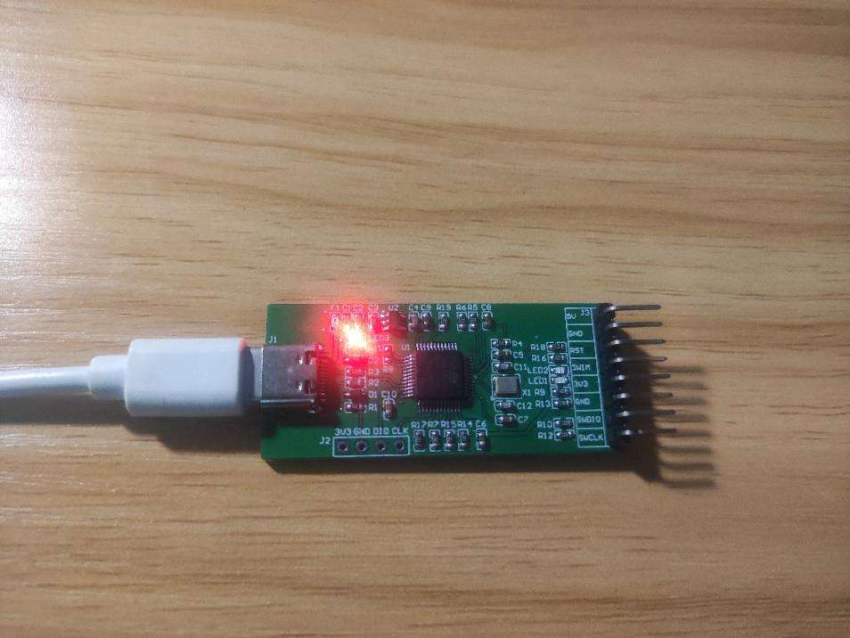
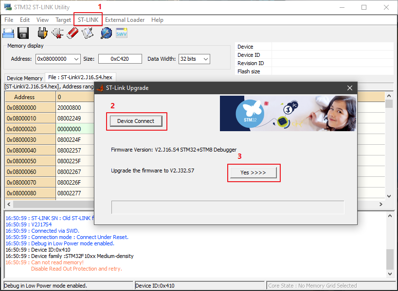
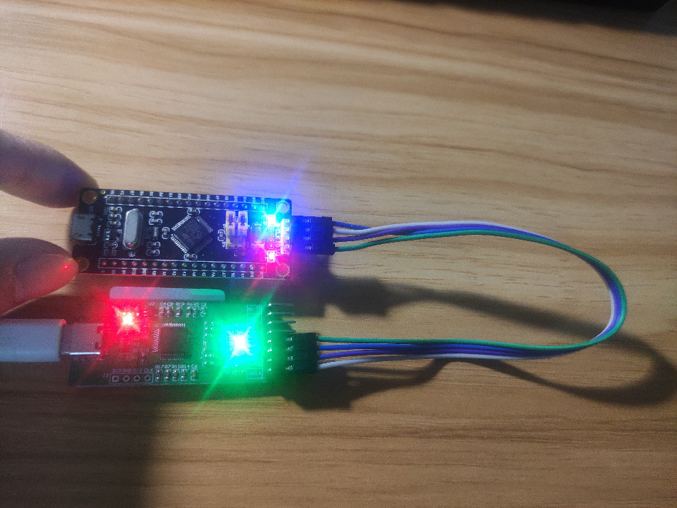
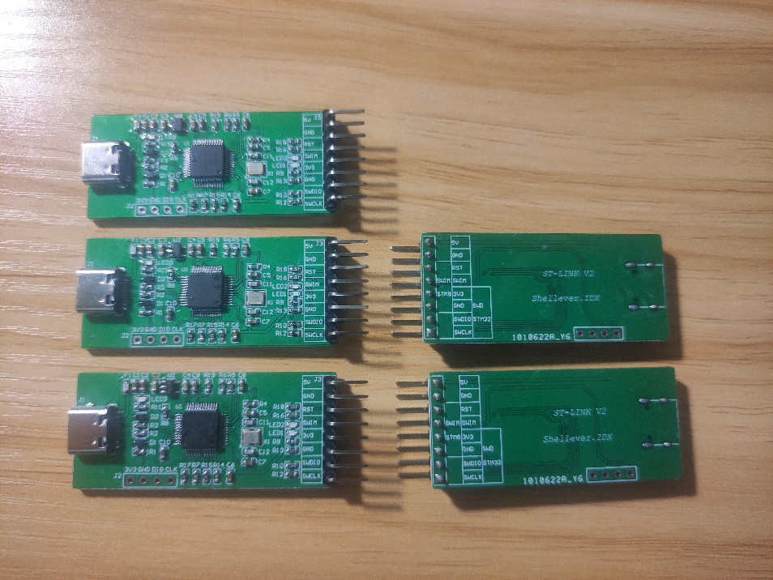

# st-link-v2

## ST-LINK 硬件说明

PCB板子正背面

自制 ST LINK V2 板子使用自定义单排排针对外烧录接口，支持 STM8 和 STM32 两种烧录。
- SWD：用于 STM32 调试和烧录
- SWIM：用于 STM8 调试和烧录

## ST-LINK 固件烧录

### ST-LINK 固件命名规则

ST-LINK 固件命名遵循一定规则：

**V** 代表主要版本
**1**：代表 ST-LINK/V1
**2**：代表 ST-LINK/V2，ST-LINK/V2-1，ST-LINK/V2-A 和 ST-LINK/V2-B
**3**：代表 STLINK-V3SET，STLINK-V3MINI，STLINK-V3MODS 和 ST-LINK-V3E

次要版本
**J**：支持 STM32 调试接口的版本 (JTAG 和 SWD 协议)。值 0 表示不支持该接口(对于 STM8 的Discovery 板，如：V2.J0.S4)。
**S**：支持 STM8 调试接口的版本(SWIM 协议)。值 0 表示不支持该接口(对于某些 STM32 的Discovery 和 Eval 板，如：V2.J33.S0)。
**M**：用于大容量存储和虚拟 COM 端口接口的版本（如：V2.J33.M25）。
**B**：桥接界面版本（V3.J1.M1.B1.S1）。

举例说明：
**V1.J13.S4**：是 ST-LINK/V1 独立版本。
**V2.J27.S6**：是 **ST-LINK/V2** 独立版本(具有 STM32 和 STM8 调试接口)。
**V2.J27.S0**：是 32F401CDISCOVERY 开发板自带 ST-Link (具有 STM32 调试接口，没有STM8 调试接口，没有大容量存储接口，没有虚拟 COM 端口)的版本。
**V2.J27.M15**：是用于核板和其他 ST-LINK/V2-1、ST-LINK/V2-A、ST-LINK/V2-B 板(具有 STM32 调试接口、大容量存储接口、虚拟 COM 端口)的版本。
**V3.J1.M1.B1.S1**：是 STLINK-V3SET 的一个版本(具有 STM8 和 STM32 调试接口、大容量存储接口、虚拟 COM 端口、网桥接口)。

ST-Link 固件的类型与硬件紧密相连。因此，不可能更改给定板的固件类型。(例如：从 V2.J27.S6 更改为 V2.J27.M15)。只能更新同一类型固件的版本(例如：V2.J25.M14 到 V2.J27.M15)。

所以，ST-Link 升级时，固件类型是升级工具自动识别类型，一般不能更改的类型。

### 烧录 ST-LINK 固件

ST-LINK 固件：ST-LinkV2.J16.S4.hex
固件烧录工具：STM32 ST-LINK Utility

使用现有的 ST-LINK V2 工具连接板子的 SWD 固件烧录接口。

然后使用 STM32 ST-LINK Utility 工具将 ST-LINK 固件烧录到板子即可。
	1. 打开 ST-LINK 固件 文件
	2. 连接到目标板子，查看是否连接正常
	3. 打开烧写下载框
	4. 点击开始(Start)按钮执行烧写

### 更新 ST-LINK 固件
V2.J16.S4 -> V2.J32.S7

首先拔掉现有的 ST-LINK V2 工具，避免更新时无法正常识别出来自制的ST-LINK板子。然后将烧录好固件的自制ST-LINK板子，使用 USB Typer C 线连接电脑。

再次使用 STM32 ST-LINK Utility 工具对板子固件进行更新，完成后才能正常使用。
	1. 依次点击主菜单 /ST-LINK/Firmware update 打开升级框
	2. 点击连接设备，自动识别当前板子固件版本信息 (V2.J16.S4 STM32+STM8 Debugger)
	3. 点击确认(Yes)按钮，执行固件更新操作 (V2.J32.S7)

## ST-LINK 烧写测试

## 特别感谢

感谢嘉立创免费PCB打样，5块板子全部正常。

哈哈，按照小贝的话说：此等羊毛不薅非人哉。不过，以后有机会还是要支持下，不然一直白嫖还真的不太好意思咧。

## 问题记录

### Cannot Load Flash Programming Algorithm

**根因分析**
因为用杜邦线连接，距离远再加上连接不稳定，导致程序下载不了。

**解决方法**
将 40cm 长的杜邦线更换成 20 cm 左右的即可。

**参考链接**
[Cannot Load Flash Programming Algorithm ！错误解决方案，亲自验证过的几套方案](https://blog.csdn.net/qq_35671135/article/details/87865259)

### Can not read memory, Disable Read out Protection and retry

**根因分析**
烧录固件时，由于芯片写保护，无法读取存储内容，导致烧录失败。

**解决方法**
在 STM32 ST-LINK Utility 工具主界面中，依次选择主菜单 /Target/Option Bytes...
然后将 protection 去掉，再点击 应用(apply) 按钮即可生效。

**参考链接**
[stm32 read out protection](https://blog.csdn.net/yazhouren/article/details/77674718)

## 参考链接

[ST-LINKV2极简版](https://oshwhub.com/jdsuchen/st-linkv2-ji-jian-ban)

[ST_Link_V2 Type-C](https://oshwhub.com/Aegis/st_link_v2)

[教你自制ST-LinkV2下载器](https://blog.csdn.net/u011976086/article/details/53817901)

[教你自做STLINK-V2下载器，免费开源](https://www.cnblogs.com/pudonglin/p/14216141.html)

[ST-LINK V2 DIY笔记 之 固件更新方法](https://www.cnblogs.com/cuter/p/8879993.html)

[STSW-LINK007 - ST-LINK, ST-LINK/V2, ST-LINK/V2-1, STLINK-V3 boards firmware upgrade](https://www.st.com/en/development-tools/stsw-link007.html)

[立创商城_电子元器件采购网上商城_领先的现货元器件交易平台-嘉立创电子商城](https://www.szlcsc.com/)

